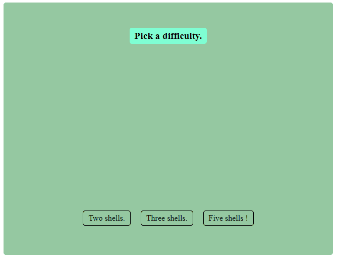

# Olivier's Game of Shells

Hello and welcome to my [Game of Shells](https://en.wikipedia.org/wiki/Shell_game) implementation !

# Sneak Peek

# Prerequisites

- [Node.js LTS (tested with version > 16)](https://nodejs.org/en/download/)

# Chosen technologies

- [React !](https://reactjs.org/). Used version 18 because I wanted to try it.
- [Styled components](https://styled-components.com/) (I love CSS in JS), I could have picked [emotion](https://emotion.sh/docs/introduction) too.
- [Vite](https://vitejs.dev/), a new build tool for web projects.
- [ESlint](https://eslint.org/), to detect and fix linting issues.
- [Prettier](https://prettier.io/), to automatically format on save my files.

# Get started

- `npm install` to install all dependencies
- `npm run dev` to start a local instance of the app.
- Navigate to `localhost:3000` with the browser of your choice (tested with Chrome only :D) !

# More options

- `npm run lint` to check for linting issues.
- `npm run lint-fix` to fix automatically 'fixable' linting issues.
- `npm run test` to execute the test.

# Areas of improvements - If I had more time

## Improvements.

### Look and feel improvements

- Use SVG that I find on the internet / ask a designer to draw the shells, in a company I would definitely ask for a designer's shell :-).
- Spend some time to use a design system for the rest of the app. Something like [Mantine](https://mantine.dev/), which has caught my eye recently.
- Make it responsive, probably ! I only tested this on a Desktop computer :-).
- Play with perspective effects to make it appear as if some Shells pass behind the others when shuffled.

### Other improvements

- The difficulty could also pilot the shuffling animation time to make it harder to follow the ball.
- I would add more tests. Some E2E tests with [Cypress](https://www.cypress.io/) could be added, too.
- I would host a compiled version of the app, for easy testing online in a github page.

# Disclaimer

- I developed the app on Windows (on my personal computer). Apologies in advance if you encounter CRLF issues while checking out the app.
- I only tested the app on Chrome. I think it should be fine on Edge and Firefox though, I don't know about Safari!
- I am new at Keyframes and CSS animation in general but I thought it could apply here, so I am happy to have learned how to use it.
